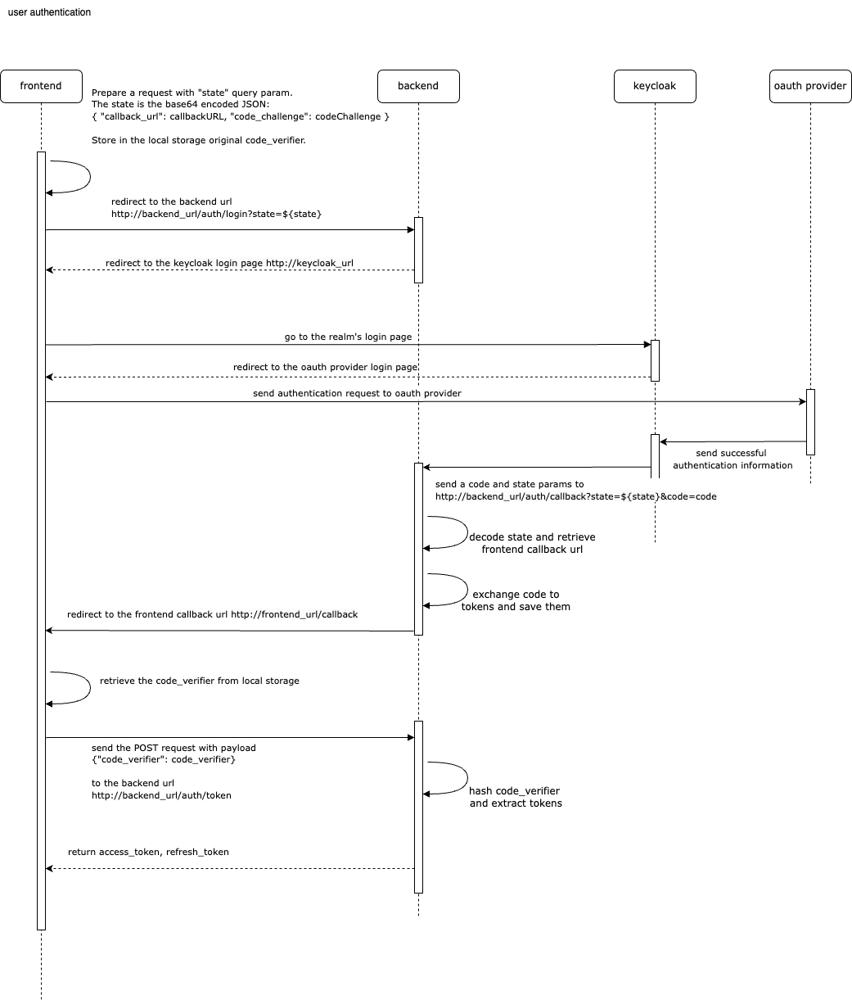

# Authentication

In this section we focus on the authentication for frontend SPA. The main focus here - the security.

For this approach we don't need share any information about keycloak client. The FE doesn't need to know any urls and secrets.

The general schema presented here

[authentication schema source file](./authentication.drawio)



## Details

### The first step on the frontend part

Our backend expects the base64 encoded JSON object. In this object should be minimum 2 fields: { "callback_url": callbackURL, "code_challenge": codeChallenge }.

The `callback_url` is the url for the redirected page from backend. It's used for redirect after successful authorisation.

The `code_challenge` is the SHA256 hash for `code_verifier` code. 

The `code_verifier` is needed for proving the access to the stored access tokens on the last step.

And the `code_verifier` should be stored in the local (or if possible session) browser storage.

Example:

```js
      // imagine, the login page is http://frontend_url/login
      
      const originalUrl = window.location.href;
      const url = originalUrl.substring(0, originalUrl.indexOf("/login"));
      
      // the callback url for processing the response from backend
      const callbackURL = `${url}/callback`

      const codeVerifier = generateCodeVerifier()
      localStorage.setItem('code_verifier', codeVerifier);

      let codeChallenge = CryptoJS.SHA256(codeVerifier).toString(CryptoJS.enc.Hex);
      let stateObj = JSON.stringify({ "callback_url": callbackURL, "code_challenge": codeChallenge })

      const state = btoa(stateObj).replace(/=+$/, '');

      // Redirect to the backend's login endpoint
      window.location.href = `http://backend_url/auth/login?state=${state}`;
```

The last line redirects to the backend endpoint, which generates the auth URL and redirects to it.

Example:

```go
func startLogin(c *gin.Context) {
	// Generate OAuth2 login URL
	state := c.Query("state")
	oauthURL := oauth2Config.AuthCodeURL(state)
	c.Redirect(http.StatusFound, oauthURL)
}
```

### The tokens processing

After the successful authorisation, the keycloak redirects to the backend callback url with `code` and `state` url query params. 
The backend extracts tokens from `code`, the `code_challenge` and `callback_url` from `state` and save the data in the local storage or cache. 
The key for tokens is `code_challenge`. After all the backend redirects to the `callback_url`.

### Retrieve data for frontend

After the backend redirected to the frontend `callback_url` the frontend should extract the `code_verifier` from the local or session storage. 
Then the frontend should send a POST request to the backend's token url

Example:
```js
    handleCallback() {
        const codeVerifier = localStorage.getItem("code_verifier");
        if (codeVerifier == null) {
          console.error("invalid code_verifier");
          return;
        }

      let config = {
        headers: {
          'Content-Type': 'application/json',
        },
      };
      axios.post("http://backend_url/auth/token", {"code_verifier": codeVerifier}, config)
    }
```
The backend calculates the SHA256 for `code_verifier` and extract saved data from cache or local storage. And return user tokens.

# Authentication middleware

On the backend side we check all incoming requests and try to extract `Bearer` header with access token. 
After successful extraction we get public keys from keycloak realm. And check the `access_token` by these keys.

# How to get a token locally

```shell
curl -X POST   http://localhost:8080/realms/myapp/protocol/openid-connect/token   \
-H "Content-Type: application/x-www-form-urlencoded"   \
-d "grant_type=password"   \
-d "client_id=client"   \
-d "username=user"   \
-d "password=user" \
-d "client_secret=secret"
```