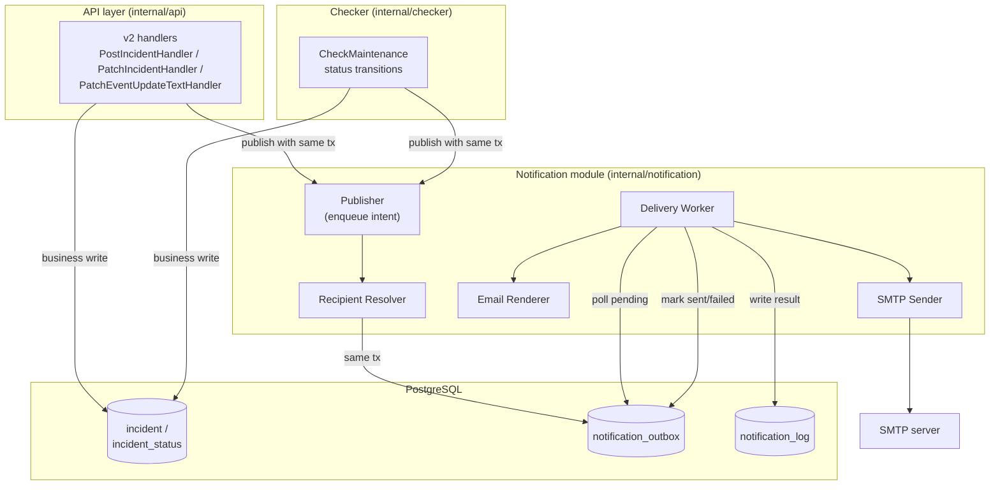
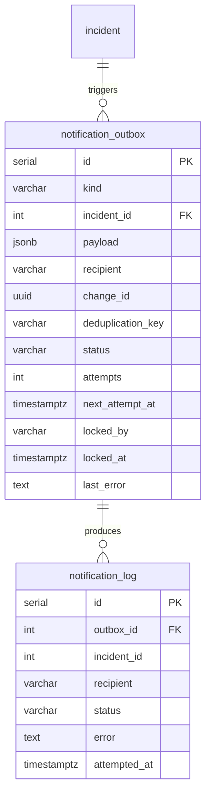
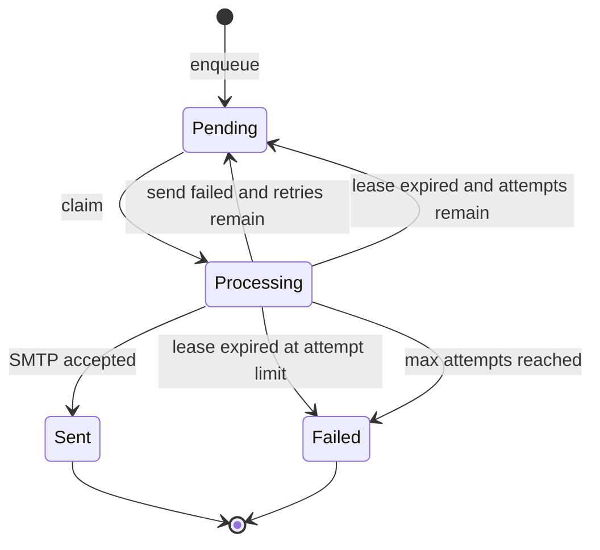
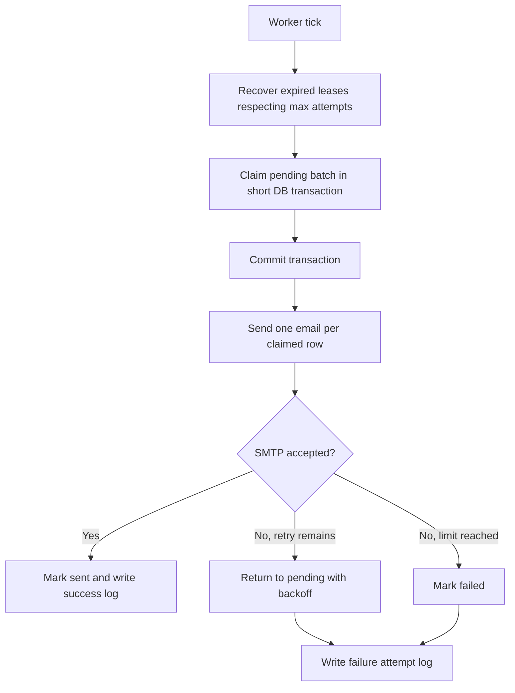
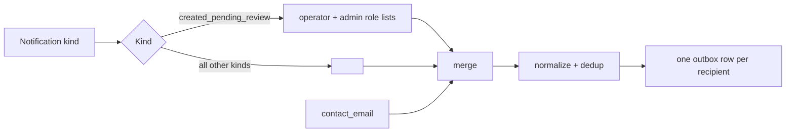
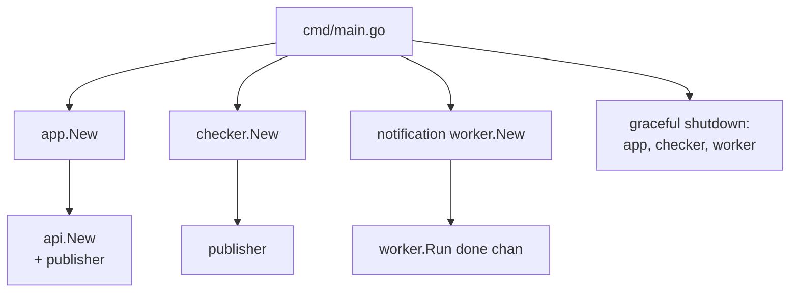

# Architecture: Maintenance Email Notifications

This document describes the technical architecture for maintenance email notifications.
It is the implementation counterpart to [final_scope_email.md](final_scope_email.md) and must
stay consistent with the scope, recipient rules, and event taxonomy defined there.

---

## 1. Architectural Overview

The feature adds an asynchronous, database-backed email delivery pipeline to the existing
monolith. Business write paths (API handlers and the checker goroutine) record a durable
notification intent inside the same database transaction that persists the maintenance change.
A background worker consumes those intents and delivers email through SMTP.

Design goals:

1. Business requests never block on SMTP.
2. No notification intent is lost after a committed maintenance change.
3. Notification failures never fail the originating business operation.
4. Recipient routing is derived from the existing RBAC role model.

### Component Diagram



---

## 2. Module Structure

New package `internal/notification` owns all notification logic. It has no dependency on
`internal/api` to avoid import cycles; shared domain types live in `internal/event` or in
the notification package itself.

```
internal/
  notification/
    notification.go      # public types: Notification, Kind, Actor, Payload
    publisher.go         # Publisher: enqueue intent inside a caller tx
    resolver.go          # Recipient resolution from RBAC roles + contact_email
    renderer.go          # Subject/body rendering from templates
    worker.go            # Background poll/deliver/retry loop + lifecycle
    smtp.go              # SMTP sender (net/smtp), TLS handling
    templates/
      maintenance_created_pending_review.tmpl
      maintenance_created_planned.tmpl
    maintenance_changed.tmpl
      maintenance_update_text_changed.tmpl
      maintenance_status_changed_by_checker.tmpl
  db/
    notification.go      # outbox/log models + DB access (enqueue, claim, mark, log)
```

Rationale for placement:

1. `db/notification.go` keeps all persistence in the existing `db` package, consistent with
   `db.ModifyIncident` and the current GORM setup in [internal/db/db.go](../../internal/db/db.go).
2. `internal/notification` holds domain logic and the worker, mirroring how `internal/checker`
   is a self-contained background component started from [cmd/main.go](../../cmd/main.go).

---

## 3. Data Model

Two new tables. Migration `000007_notification.up.sql` / `.down.sql`, following the existing
`golang-migrate` layout under `db/migrations/`.

### 3.1 `notification_outbox`

Durable queue of email delivery tasks. One row represents one email to one recipient. A producer
may insert several rows for one maintenance change after recipient resolution and deduplication.
This allows independent retries and prevents an already successful recipient from receiving a
duplicate when delivery to another recipient fails.

| Column | Type | Notes |
|--------|------|-------|
| `id` | `SERIAL PK` | |
| `kind` | `VARCHAR(64)` | event taxonomy value (see scope) |
| `incident_id` | `INTEGER` | FK → `incident(id)`, the maintenance event |
| `payload` | `JSONB` | rendered-independent event data (title, statuses, actor, timestamp, link data) |
| `recipient` | `VARCHAR(255)` | one normalized recipient address |
| `change_id` | `UUID` | generated once for each successful business mutation |
| `deduplication_key` | `VARCHAR(255)` | stable key: change ID + kind + normalized recipient |
| `status` | `VARCHAR(20)` | `pending` / `processing` / `sent` / `failed`, default `pending` |
| `attempts` | `INTEGER` | default `0` |
| `next_attempt_at` | `TIMESTAMPTZ` | default `NOW()`, drives backoff scheduling |
| `locked_by` | `VARCHAR(255)` | Kubernetes pod/worker identity, nullable |
| `locked_at` | `TIMESTAMPTZ` | claim lease start, nullable |
| `last_error` | `TEXT` | last delivery error, nullable |
| `created_at` | `TIMESTAMPTZ` | default `NOW()` |
| `updated_at` | `TIMESTAMPTZ` | default `NOW()` |

Index:

```sql
CREATE INDEX idx_outbox_dispatch
    ON notification_outbox (next_attempt_at)
    WHERE status = 'pending';

CREATE INDEX idx_outbox_stale_processing
    ON notification_outbox (locked_at)
    WHERE status = 'processing';

CREATE UNIQUE INDEX idx_outbox_deduplication
    ON notification_outbox (deduplication_key);
```

> Recipients are resolved at enqueue time. Each address is stored in a separate row. This keeps
> delivery deterministic and independent of later RBAC config changes, supports per-recipient
> retries, and avoids re-resolving roles inside the worker.

### 3.2 `notification_log`

Append-only delivery audit.

| Column | Type | Notes |
|--------|------|-------|
| `id` | `SERIAL PK` | |
| `outbox_id` | `INTEGER` | FK → `notification_outbox(id)` |
| `incident_id` | `INTEGER` | denormalized for querying |
| `recipient` | `VARCHAR(255)` | single recipient (one row per address) |
| `status` | `VARCHAR(20)` | `sent` / `failed` |
| `error` | `TEXT` | failure reason, nullable |
| `attempted_at` | `TIMESTAMPTZ` | default `NOW()` |

Indexes on `outbox_id` and `attempted_at` for operational queries.

### ER Diagram



---

## 4. Producer Integration

The publisher enqueues intents using the caller's `*gorm.DB` transaction handle so the intent
commits atomically with the maintenance change. This requires a small extension to the write
paths that currently call `db.ModifyIncident`.

### 4.1 API write paths

Integration points (current code):

1. Creation — [internal/api/v2/v2.go](../../internal/api/v2/v2.go) `createEvent` / `PostIncidentHandler`.
2. Field or status patch — [internal/api/v2/v2.go](../../internal/api/v2/v2.go) `PatchIncidentHandler`.
3. Update text patch — [internal/api/v2/v2.go](../../internal/api/v2/v2.go) `PatchEventUpdateTextHandler`.

Rules:

1. Enqueue only when `stored.Type == event.TypeMaintenance`.
2. Enqueue only after successful validation/authorization and only on the success path
   (never on 400/403/409/500).
3. The publisher is a no-op when `SD_NOTIFICATIONS_ENABLED` is false.

Because `db.ModifyIncident` currently owns its own transaction internally, the cleanest option
is to add a transaction-aware variant (e.g. `ModifyIncidentTx`) or have the publisher accept the
same `tx` used by the modify operation, so both writes share one commit boundary.

### 4.2 Checker write path

Integration point: [internal/checker/maintenance.go](../../internal/checker/maintenance.go)
`processMaintenance`, immediately after a status change is persisted via `ModifyIncident`.

Rules:

1. Actor is `checker`.
2. Kind is `maintenance_status_changed_by_checker`.
3. Backfilled intermediate statuses in a single checker pass must produce at most one
   notification for the final persisted transition to avoid duplicate emails.
4. The checker currently runs in every application pod. Competing checker executions rely on the
    maintenance optimistic lock: only the transaction that successfully updates the expected
    version may insert outbox rows. A transaction that receives `ErrVersionConflict` must insert
    nothing and must not publish after the transaction returns.

---

## 5. Delivery Worker

Every application pod runs one worker as a background goroutine. The worker follows the same
lifecycle model as the checker: it is created in [cmd/main.go](../../cmd/main.go), started with a
`done` channel, and stopped on shutdown. Concurrent workers coordinate exclusively through
PostgreSQL; no in-memory lock is used across pods.

### Worker loop

Each outbox row follows this state machine:



Claiming and delivery are separate steps. The database transaction ends before the SMTP call:



Key mechanics:

1. Row claiming uses `SELECT ... FOR UPDATE SKIP LOCKED` followed by an update to `processing`
    inside one short transaction. This is mandatory because all Kubernetes pods run workers.
2. The claim transaction is committed before SMTP is called. A database transaction or row lock
    must never be held during network I/O.
3. Claiming increments `attempts`. A pod crash therefore consumes an attempt instead of allowing
    an item to cycle through stale lease recovery forever.
4. `locked_by` contains the pod/worker identity and `locked_at` starts a lease. A periodic recovery
    query returns stale `processing` rows with remaining attempts to `pending`. Rows at the attempt
    limit are moved to `failed`. This prevents a pod crash from leaving work permanently stuck or
    bypassing the retry limit.
5. SMTP operations use a strict timeout. The lease timeout must be greater than the SMTP timeout
    plus the maximum time a claimed row can wait inside the local worker pool. Claim batches and
    worker concurrency must be bounded so this invariant remains true.
6. Backoff: `next_attempt_at = now + base * 2^attempts`, capped at a max delay.
7. Bounded retries: after `maxAttempts`, the row is set to `failed` with `last_error` retained.
8. The outbox status update and corresponding `notification_log` insert are committed in one
    short database transaction for both successful and failed attempts.
9. Panic isolation: each intent is processed inside a `recover()` boundary so a bad template or
    send never crashes the worker.

---

## 6. Recipient Resolution

Resolution runs at enqueue time and produces a deduplicated address list. The producer inserts one
outbox row for each resolved address in the same business transaction.



Rules:

1. Role lists come from configuration (`SD_NOTIFICATIONS_EMAILS_OPERATORS`,
   `SD_NOTIFICATIONS_EMAILS_ADMINS`), not from hardcoded IdP group names.
2. `contact_email` from the maintenance event is always included when present.
3. Addresses are lowercased and deduplicated before storage.
4. Every successful business mutation receives a new UUID `change_id` inside its transaction.
    A stable `deduplication_key` prevents that mutation from enqueueing the same recipient more
    than once and is constructed as `<change_id>:<kind>:<normalized-recipient>`. Editing the same
    status/update record again receives a new `change_id` and therefore produces a new notification.
5. If the resolved list is empty, no outbox row is created (nothing to deliver).

---

## 7. Configuration and Lifecycle

### Configuration

Extends `conf.Config` in [internal/conf/conf.go](../../internal/conf/conf.go) with an
`SMTP`/notification block, parsed with the existing `envconfig` + `.env` merge mechanism.
Validation added to `Config.Validate`:

1. When `SD_NOTIFICATIONS_ENABLED=true`, SMTP host/port/from must be set.
2. SMTP secrets masked in `Config.Log` (reuse `maskSecret`).

### Startup wiring



The worker receives the existing `*db.DB` through dependency injection and shares that connection
pool with the API inside the pod. It must not create another pool: with multiple pods, separate API,
checker, and worker pools would multiply the configured PostgreSQL connection limit. Pool sizing
must be calculated as `max_open_connections_per_pod * maximum_pod_count`, including any remaining
separate checker pool.

The worker is shut down alongside the app and checker in the existing signal-driven shutdown block
in [cmd/main.go](../../cmd/main.go). The Kubernetes termination grace period must be longer than the
worker shutdown timeout. On shutdown, the worker stops claiming new rows and waits for in-flight
sends up to that timeout; unfinished claims are later recovered through the lease mechanism.

---

## 8. Failure and Idempotency Model

1. Atomic enqueue: intent + maintenance change share one transaction; a rolled-back business
   change leaves no orphan intent.
2. At-least-once delivery: workers may retry; delivery is not exactly-once. Atomic row claiming
    prevents concurrent sends by different pods. A duplicate remains possible if SMTP accepts an
    email and the pod dies before recording success; the system explicitly accepts this trade-off.
3. Isolation: worker/SMTP failures are logged to `notification_log` and never propagate to API
   responses.
4. Recoverability: pending rows survive restarts. After their lease expires, stale `processing`
    rows return to `pending` when attempts remain or move to `failed` at the attempt limit.

---

## 9. Observability

1. Metrics: outbox queue depth (pending and processing counts), stale lease count,
   sent/failed counters, retry counter, and delivery latency.
2. Structured logs: every delivery attempt logs `outbox_id` and `incident_id` for correlation,
   consistent with the existing `zap` logging style.
3. Operational recovery: failed rows are queryable by `status='failed'` for manual re-drive.
4. Retention: sent rows and delivery logs are deleted or archived after a configured retention
    period in bounded batches. Failed rows are retained longer for investigation and manual re-drive.

---

## 10. Architectural Assessment

The architecture is suitable for a multi-pod Kubernetes deployment when the following constraints
are treated as required implementation contracts:

1. Maintenance mutation and outbox insertion share one PostgreSQL transaction.
2. Every delivery row has exactly one recipient; retries never repeat successful recipients.
3. Workers claim rows atomically with `FOR UPDATE SKIP LOCKED` and release DB locks before SMTP.
4. Stale claims are recovered through a bounded lease, with timeouts configured to prevent an
    active send from being reclaimed prematurely.
5. Result state and attempt log are persisted atomically.
6. Workers reuse the pod's DB pool and connection capacity is budgeted for the maximum replica count.

Accepted trade-off: delivery is at-least-once. A duplicate email remains possible if SMTP accepts
the message and the pod terminates before PostgreSQL records success. SMTP provides no distributed
transaction or generally usable idempotency key, so eliminating this window is not realistic.

---

## 11. Traceability to Scope

| Scope element | Architecture realization |
|---------------|--------------------------|
| Async, non-blocking delivery | Outbox + background worker (§1, §5) |
| No intent loss | Atomic enqueue in business tx (§4, §8) |
| Role-based routing | Recipient resolver from RBAC config (§6) |
| Event taxonomy | `kind` column + templates (§2, §3) |
| Bounded retries / backoff | Worker retry policy (§5) |
| Failure isolation | `recover()` + log-only failures (§5, §8) |
| Secure config | Masked secrets, fail-fast validation (§7) |
