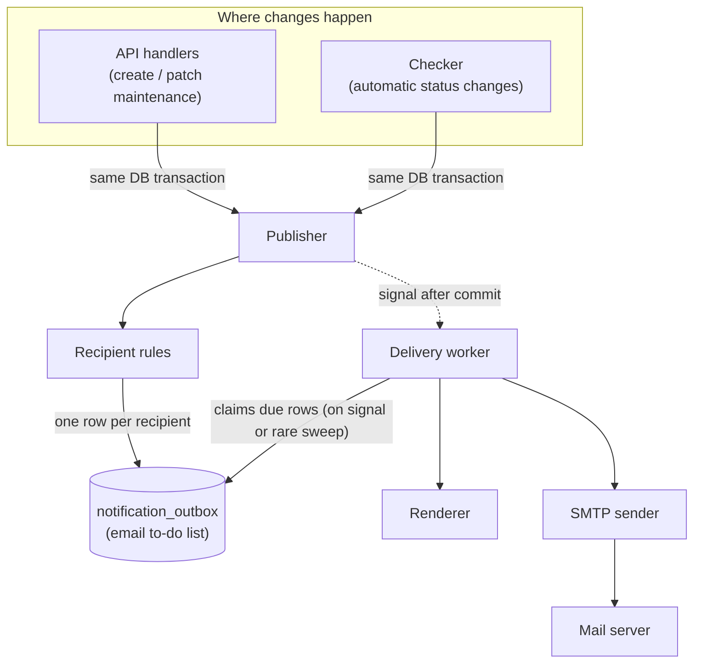
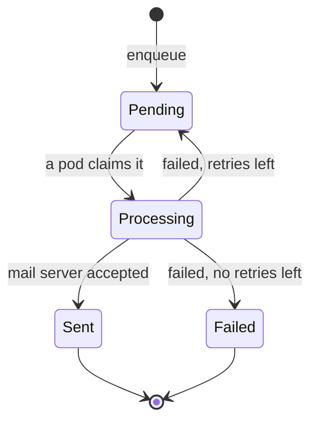
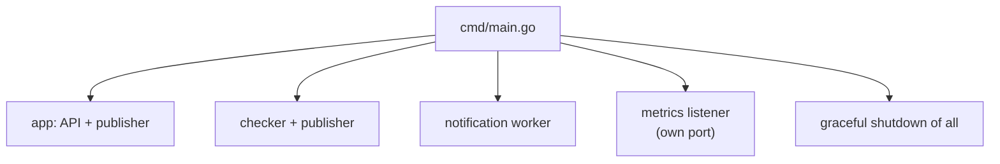

# Architecture: Maintenance Email Notifications

This document describes how maintenance email notifications work — the design and the reasoning
behind it. For deployment settings see [configuration.md](configuration.md); for planned work see
[improvements.md](improvements.md).

The goal is simple: **when a maintenance event is created or its status changes, send an email to
the right people.** Everything below explains how that happens without slowing down the API.

---

## 1. Who gets notified

There are two audiences:

1. **Review audience** — notified while the maintenance still needs a human decision. It consists of:
   - the RBAC roles that can review and approve maintenance: **Operator** and **Admin**
     (see [../auth/rbac.md](../auth/rbac.md) and [../auth/permissions.md](../auth/permissions.md)),
     via per-role email lists in configuration; plus
   - a fixed **SMOD team** address (`SD_NOTIFICATIONS_SMOD_EMAIL`, for example `support@com.com`).
   None of these come from the request — they are all predefined in configuration.
2. **Creator** — the maintenance contact address. It arrives in the create request
   (field `contact_email`) and is stored in the `incident.contact_email` column.

The recipients are decided by the **resulting maintenance status**:

| Maintenance goes to… | Review audience (Operator + Admin + SMOD team) | Creator |
|----------------------|:----------------------------------------------:|:-------:|
| `pending_review` (just created for review) | ✅ | ✅ |
| `reviewed` (approved) | ✅ | ✅ |
| `planned` | ❌ | ✅ |
| `in_progress` | ❌ | ✅ |
| `completed` | ❌ | ✅ |
| `cancelled` | ❌ | ✅ |

In words:

- While the maintenance still needs a human decision (`pending_review`, `reviewed`),
  the review audience (operators, admins, and the fixed SMOD team address) and the creator are
  informed.
- Once it is an ordinary lifecycle change (`planned` → `in_progress` → `completed`, or `cancelled`),
  only the creator is informed.

This rule is the same whether the status changed through the API or automatically through the
checker.

---

## 2. How it works, end to end



The flow has two independent halves:

1. **Recording the intent** (fast, inside the request): a maintenance change writes one email task
   per recipient into the `notification_outbox` table, in the **same transaction** as the change.
2. **Sending the email** (background): the worker is triggered **right after the change commits**
   and sends immediately. A **low-frequency safety sweep** catches anything the immediate path
   missed — retries and rows orphaned by a pod crash.

The API never waits for the mail server. If email fails, the maintenance change is unaffected.
Because dispatch is event-driven, there is **no constant polling**: on an idle system (our volume is
about 41 maintenances in 2 months) the worker does almost nothing.

---

## 3. The components, explained

Each component below has one clear job.

### Publisher
**What it does:** writes email tasks into the outbox.
**Why it exists:** it guarantees the email task is saved *together* with the maintenance change.
If the maintenance change is rolled back, the email task is rolled back too — so we never send an
email about something that did not actually happen, and we never lose an email for something that
did.

### Recipient rules
**What it does:** looks at the resulting maintenance status and produces the recipient list
(review audience — operators, admins, and the fixed SMOD team address — the creator, or both) using
the table in §1.
**Why it exists:** it keeps the "who gets what" logic in one small, testable place instead of
scattered across handlers. The operator and admin parts map to the RBAC roles that can approve
maintenance; their addresses and the SMOD team address come from configuration, not from the
requester's token.

### notification_outbox (table)
**What it does:** a durable to-do list of emails. One row = one email to one recipient.
**Why it exists:** it decouples "we decided to send an email" from "the email was actually sent".
It survives restarts, so nothing is lost if a pod dies.

### Delivery worker
**What it does:** runs in every pod. On the happy path it is triggered right after a maintenance
change commits and sends the emails immediately. It also runs a **low-frequency safety sweep** to
pick up retries and rows orphaned by a pod crash.
**Why it exists:** it moves the slow network work (SMTP) out of the API request path and retries
failures on its own. Because dispatch is event-driven rather than a tight polling loop, an idle
system consumes almost no resources — which matters at our low event volume. Crucially, retry state
lives in the outbox row (`next_attempt_at`), **not in memory**, so pending retries survive a pod
restart and are shared across pods.

### Renderer
**What it does:** turns a stored task into a real email — subject, body, and a link to the
maintenance.
**Why it exists:** it keeps email formatting (templates) separate from delivery logic.

### SMTP sender
**What it does:** connects to the mail server and sends one email.
**Why it exists:** it isolates the only part that talks to the outside world, with its own timeout,
authentication, and TLS settings.
**Implementation note:** the Gin backend connects **directly** to the OTC (Open Telekom Cloud) SMTP
endpoint. It does **not** call any external mail gateway. The sender uses a maintained Go mail
library (`github.com/wneessen/go-mail`) rather than bare `net/smtp`, for robust MIME, auth, and TLS
handling.

---

## 4. Data model — one table

Migration `000008_notification.up.sql` / `.down.sql`, following the existing `golang-migrate`
layout under `db/migrations/`.

### `notification_outbox`

One row represents one email to one recipient.

| Column | Type | Meaning |
|--------|------|---------|
| `id` | `SERIAL PK` | row id |
| `kind` | `VARCHAR(64)` | why the email is sent (`pending_review`, `reviewed`, `status_changed`) |
| `incident_id` | `INTEGER` | the maintenance event (FK → `incident(id)`) |
| `recipient` | `VARCHAR(255)` | the single email address |
| `payload` | `JSONB` | data needed to render the email (title, old/new status, actor, link) |
| `change_id` | `UUID` | one id per maintenance change, used to avoid duplicates |
| `dedup_key` | `VARCHAR(255)` | unique key `change_id + kind + recipient` |
| `status` | `VARCHAR(20)` | `pending` → `processing` → `sent` / `failed` |
| `attempts` | `INTEGER` | how many times we tried to send |
| `next_attempt_at` | `TIMESTAMPTZ` | when the row becomes eligible again (backoff) |
| `locked_by` | `VARCHAR(255)` | which pod is currently sending it |
| `locked_at` | `TIMESTAMPTZ` | when that pod claimed it (used to recover crashes) |
| `last_error` | `TEXT` | last failure reason |
| `created_at` / `updated_at` | `TIMESTAMPTZ` | timestamps |

```sql
CREATE INDEX idx_outbox_dispatch
    ON notification_outbox (next_attempt_at)
    WHERE status = 'pending';

CREATE INDEX idx_outbox_stale_processing
    ON notification_outbox (locked_at)
    WHERE status = 'processing';

CREATE UNIQUE INDEX idx_outbox_dedup
    ON notification_outbox (dedup_key);

-- Supports retention pruning and the sent-count observability stat.
CREATE INDEX idx_outbox_retention
    ON notification_outbox (updated_at)
    WHERE status = 'sent';
```

### Column groups, explained

The columns fall into five groups:

1. **What the email is about:** `kind`, `incident_id`, `recipient`, `payload`.
   `payload` is a snapshot of the data needed to render the email, so the worker never has to read
   the maintenance again and the email is unaffected by later changes.
2. **Duplicate protection:** `change_id` + `dedup_key`. `change_id` is generated once per successful
   maintenance change and shared by all rows of that change. `dedup_key` (`change_id : kind :
   recipient`) is unique, so the same email to the same address for the same change cannot be
   inserted twice — even under retries or a race between pods.
3. **Delivery state:** `status`, `attempts`, `next_attempt_at`, `last_error`. These also serve as the
   audit trail, which is why no separate log table is needed.
4. **Multi-pod coordination:** `locked_by`, `locked_at`. They record which pod is sending a row and
   when it claimed it, so a crashed pod's stuck row can be recovered after the lease expires.
5. **Bookkeeping:** `created_at`, `updated_at`.

### Example: one maintenance change becomes several rows

Maintenance #42 is created in `pending_review`. Recipients are the SMOD team address, the operator
list, the admin list, and the creator. The producer generates one `change_id` and inserts one row
per recipient in the same transaction as the maintenance creation:

| id | kind | incident_id | recipient | change_id | status |
|----|------|:-----------:|-----------|-----------|--------|
| 1 | `pending_review` | 42 | support@com.com | `a1b2…` | `pending` |
| 2 | `pending_review` | 42 | ops@com.com | `a1b2…` | `pending` |
| 3 | `pending_review` | 42 | admin@com.com | `a1b2…` | `pending` |
| 4 | `pending_review` | 42 | creator@com.com | `a1b2…` | `pending` |

The worker then processes them one at a time:

1. Claims a row → `status = processing`, `locked_by = pod-1`, `locked_at = now`, `attempts++`.
2. Commits that claim, then sends the email.
3. On success → `status = sent`. On a temporary failure → back to `pending` with a later
   `next_attempt_at`, or `failed` once attempts run out. On a permanent rejection (`5xx`) → `failed`
   straight away.

Four separate rows give **independent retries**: if the email to the admin list fails, only that
row is retried — the SMOD team, operator, and creator emails are not sent again.

### Do we need a separate `notification_log` table?

**No.** The outbox row already records everything an audit needs:

- final `status` (`sent` / `failed`),
- `attempts`,
- `last_error`,
- `updated_at` (when it reached that state).

A separate log table would just duplicate this for our small scope. Sent rows are kept for a
retention period (for audit and re-drive) and then cleaned up. If richer per-attempt history is
ever required, a log table can be added later without changing the delivery design.

---

## 5. Sending the email (the worker)

Every pod runs one worker. Because there are multiple pods, they coordinate through PostgreSQL so
the same email is not sent twice at the same time.

**What wakes the worker:**

1. **A signal after commit (happy path).** When a maintenance change commits, the publisher signals
   the in-process worker (via a channel) to send right away. No waiting for a poll tick.
2. **A low-frequency safety-sweep ticker.** Every few minutes the worker also scans for due rows —
   `pending` rows whose `next_attempt_at` has passed (retries) and rows stuck in `processing` after
   a crash. On our volume this sweep almost always finds zero rows, so its cost is negligible; it
   exists purely to guarantee nothing is stranded if a signal was missed (e.g. the sending pod
   restarted).

This keeps the design cheap when idle **and** durable: retries are driven by `next_attempt_at` in
the database, not by in-memory timers, so a pod restart never loses a pending retry.



The loop, in plain steps:

1. **Recover stuck rows.** If a pod claimed a row and then crashed, the row stays in `processing`.
   After a lease timeout it is returned to `pending` (or set to `failed` if it already used all
   attempts).
2. **Claim one row.** Select the next due `pending` row with `FOR UPDATE SKIP LOCKED`, mark it
   `processing`, set `locked_by`/`locked_at`, and increment `attempts`. `SKIP LOCKED` guarantees two
   pods never grab the same row.
3. **Commit, then send.** The database transaction ends *before* the email is sent — a DB lock is
   never held while waiting on the network.
4. **Record the result.** On success mark `sent`. On failure either keep it `pending` with a longer
   `next_attempt_at`, or mark it `failed` — see §5.1.
5. **Stay safe.** Each send runs inside a `recover()` guard so one bad email cannot crash the
   worker.
6. **Repeat** until no due rows remain.

**Why one row at a time.** The lease starts when a row is claimed, but sends are sequential. Had the
worker claimed a batch of N rows, the last one would begin sending up to `N × smtp_timeout` after
its lease started — long past expiry. The stale-recovery path would then hand that row to another
pod (or to the next pass of the same one) while the first send was still in flight, producing
duplicate emails. Claiming one row keeps `claim → send → record` inside a single lease, so
correctness no longer depends on tuning `lease_timeout` against the batch size. The extra queries
cost nothing next to the network round-trip they accompany.

**Timing rule:** the lease timeout must be longer than the SMTP timeout so a slow-but-alive send is
never reclaimed by another pod. This is enforced at startup.

### 5.1 Permanent versus temporary failures

Not every rejection is worth retrying. The sender inspects the SMTP reply:

| Reply | Meaning | Action |
|-------|---------|--------|
| `5xx` | The server refuses this message — unknown recipient, blocked sender | `failed` immediately |
| `4xx` | Temporary — greylisting, mailbox full, rate limit | retry with backoff |
| No reply (transport error) | Unknown — DNS, connection refused, timeout | retry with backoff |

A permanent rejection is terminal on the first attempt: repeating it cannot change the outcome, and
failing fast surfaces a typo in a recipient address within seconds instead of hiding it behind hours
of backoff. Anything without a definite `5xx` is treated as temporary, so an ambiguous error never
causes a lost notification.

### 5.2 Retry backoff

A temporary failure schedules `next_attempt_at` at `base × 2^(attempts-1)`, capped at 2 hours, with
a random spread of ±20%.

The spread matters because failures correlate: when a relay goes down, every queued row fails within
the same second. Without jitter all of them would retry at the same instant, hitting the recovering
server with a synchronised burst — and repeating that burst on every subsequent attempt. Jitter
spreads the load and prevents this thundering herd.

### Design note: why retries live in the database, not in memory

At our volume (about 41 maintenances in 2 months) a tempting simplification is to skip the outbox
row and, right after saving the maintenance, send the email in a goroutine — keeping failed emails
in memory and retrying every 15 minutes. We deliberately do **not** do this. The retry *interval* is
kept (a failed row becomes eligible again after a backoff delay), but the retry *state* lives in the
outbox row (`attempts`, `next_attempt_at`, `last_error`), not in process memory, for two reasons:

1. **Pod restarts lose in-memory state.** In Kubernetes pods restart routinely (deploys, OOM,
   rescheduling). An in-memory retry timer would silently drop every email waiting to be retried —
   exactly the "problem with retries after a few failed attempts" we need to avoid. A row in the
   database survives the restart and is picked up by the safety sweep.
2. **Multiple pods cannot share memory.** With ≥2 pods, an in-memory queue in one pod is invisible to
   the others, so retries cannot be coordinated and the same email could be retried twice or not at
   all. The shared outbox table plus `FOR UPDATE SKIP LOCKED` gives one owner per row across all
   pods.

This costs almost nothing extra: the durable row is the same record the "save then send" idea would
keep anyway — we simply reuse it as the retry source instead of adding a separate in-memory
mechanism.

---

## 6. Configuration

Settings extend `conf.Config` in [internal/conf/conf.go](../../internal/conf/conf.go), using the
existing `envconfig` + `.env` mechanism. **The full reference lives in
[configuration.md](configuration.md);** this section only records the design decisions behind it.

**Everything is off by default.** `SD_NOTIFICATIONS_ENABLED` defaults to `false`, and when the
feature is off no SMTP setting is required, no worker starts, and no metrics listener opens. The
feature can be absent from an installation entirely.

**Invalid configuration fails at startup, not at send time.** When the feature is enabled the
validator parses the sender address, every review address, the SMTP port range and all durations. A
typo in an operator address would otherwise stay invisible until the first maintenance, then produce
failures on every message. Review addresses come from the operator, so they are validated as
strictly as the user-supplied `contact_email`.

**The lease must outlast the SMTP timeout,** or a slow-but-alive send would be reclaimed by another
pod. This relationship is checked at startup because it cannot be detected safely at runtime.

**The creator recipient is not configured.** It is the maintenance `contact_email` stored in the
database. The SMOD address plus the operator and admin lists form the review audience, and none of
them come from the requester's token.

**Transport:** a direct SMTP connection to the OTC (Open Telekom Cloud) endpoint. No external mail
gateway or HTTP mail API is involved. SMTP secrets are masked in logs.

---

## 7. Guarantees and trade-offs

1. **Nothing is lost.** The email task and the maintenance change are saved in one transaction, so a
   committed change always has its email task.
2. **The API never blocks.** Sending happens in the background.
3. **Failures are isolated.** A mail server problem is recorded on the outbox row and never turns
   into an API error. A permanent rejection stops after one attempt; anything ambiguous is retried.
4. **At-least-once delivery.** In a rare case (the mail server accepts the email but the pod dies
   before writing `sent`), the email may be sent twice after recovery. This is accepted: a rare
   duplicate is better than a lost notification, and plain SMTP offers no safe way to avoid it.
   Note this is the *only* remaining duplicate window — claiming one row per lease removed the
   batch-expiry case.
5. **Cheap when idle.** Dispatch is event-driven; the only recurring background activity is a rare
   safety sweep that returns nothing on an idle system. Retry state lives in the outbox row
   (`next_attempt_at`), not in memory, so retries survive pod restarts and are coordinated across
   pods — unlike an in-memory retry timer, which would lose pending emails on restart.

---

## 8. Startup and lifecycle



The worker reuses the application's existing database connection pool — it must **not** open its
own. With multiple pods, extra pools would multiply PostgreSQL connections. Budget connections as
`connections_per_pod * number_of_pods`.

The metrics listener is a second `http.Server` bound to `SD_METRICS_PORT`. It starts only when
notifications are enabled and is shut down together with the API server.

On shutdown the worker stops claiming new rows and finishes in-flight sends; anything unfinished is
recovered by the lease mechanism on the next run.

---

## 9. Observability and retention

The outbox row is the single source of truth for delivery state, so observability reads directly
from it — there is no separate metrics store. Two interfaces expose the same data:

### Prometheus `/metrics`

Served on a **separate listener** (`SD_METRICS_PORT`, default `9090`), not on the public API port,
and only when notifications are enabled. Queue depth and failure counts are operational detail that
should not be readable by anyone who can reach the dashboard, so the port is meant to stay internal
to the cluster — scraped by Prometheus, never published through an Ingress. The registry is
dedicated, so the endpoint exposes notification series only.

Two kinds of series:

- **Worker counters/histogram** (updated as rows are delivered): `notification_sent_total{kind}`,
  `notification_failed_total{kind}`, `notification_attempts_total`,
  `notification_stale_recovered_total`, `notification_delivery_duration_seconds`.
- **Queue-depth gauges** (pulled on each scrape by a DB-backed collector, so they always reflect
  current state): `notification_outbox_pending`, `_processing`, `_failed`, `_stale_processing`,
  `_retry_backlog`, `_oldest_pending_age_seconds`.

The scrape query is bounded by a timeout: Prometheus scrapes on a schedule regardless of how the
previous attempt went, so an unbounded query against a stalled database would accumulate goroutines
and connections. A failed collection increments `notification_collector_errors_total` rather than
silently omitting the gauges, which would look identical to a healthy empty queue.

### Admin ops API (`/v2/notifications/…`)

For manual inspection and recovery, admin-only:

- `GET /stats` — the same queue-depth snapshot as JSON.
- `GET /failed` — the most recent terminal-`failed` rows.
- `POST /redrive` — reset `failed` rows back to `pending` (optionally by id) and wake the worker.

### Retention

Delivery outcome lives on the outbox row, which also serves as the audit trail. To keep the table
(and the count queries above) small, the worker prunes on its safety sweep:

- `sent` rows older than **30 days** are deleted in batches (`idx_outbox_retention` supports it).
- `failed` rows are **kept indefinitely** — they are unfinished work: queryable via the ops API and
  re-drivable. (At our volume this is negligible; a longer sent-retention window is a one-constant
  change if a longer audit history is ever wanted.)

Structured logs carry `outbox_id`, `incident_id`, `recipient`, `kind`, and `attempts` for
per-delivery tracing.
