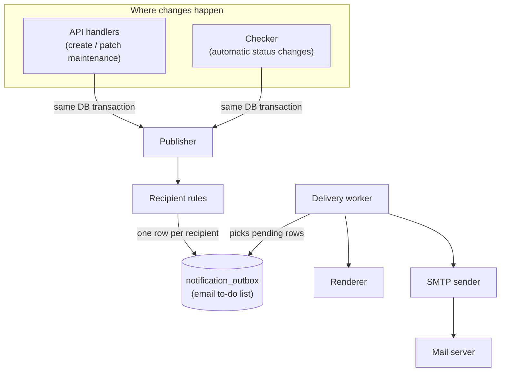
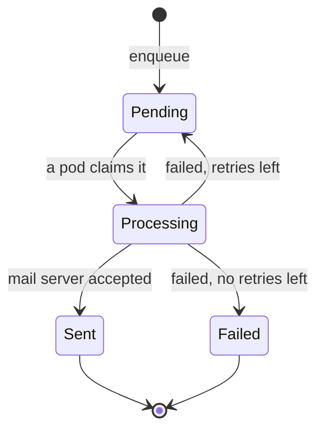
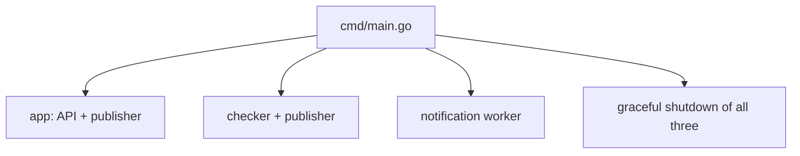

# Architecture: Maintenance Email Notifications

This document describes how maintenance email notifications work.
It is the implementation counterpart to [final_scope_email.md](final_scope_email.md).

The goal is simple: **when a maintenance event is created or its status changes, send an email to
the right people.** Everything below explains how that happens without slowing down the API.

---

## 1. Who gets notified

There are two audiences:

1. **Review audience** — the RBAC roles that can review and approve maintenance: **Operator** and
   **Admin** (see [../auth/rbac.md](../auth/rbac.md) and [../auth/permissions.md](../auth/permissions.md)).
   Their addresses are predefined email lists in configuration (one list per role), not taken from
   the request. Operationally this is the SMOD team.
2. **Creator** — the maintenance contact address. It arrives in the create request
   (field `contact_email`) and is stored in the `incident.contact_email` column.

The recipients are decided by the **resulting maintenance status**:

| Maintenance goes to… | Review audience (Operator + Admin) | Creator |
|----------------------|:----------------------------------:|:-------:|
| `pending_review` (just created for review) | ✅ | ✅ |
| `reviewed` (approved) | ✅ | ✅ |
| `planned` | ❌ | ✅ |
| `in_progress` | ❌ | ✅ |
| `completed` | ❌ | ✅ |
| `cancelled` | ❌ | ✅ |

In words:

- While the maintenance still needs a human decision (`pending_review`, `reviewed`),
  the review audience (operators and admins) and the creator are informed.
- Once it is an ordinary lifecycle change (`planned` → `in_progress` → `completed`, or `cancelled`),
  only the creator is informed.

This rule is the same whether the status changed through the API or automatically through the
checker.

---

## 2. How it works, end to end



The flow has two independent halves:

1. **Recording the intent** (fast, inside the request): a maintenance change writes one email task
   per recipient into the `notification_outbox` table, in the **same transaction** as the change.
2. **Sending the email** (background): a worker reads the outbox and delivers the emails.

The API never waits for the mail server. If email fails, the maintenance change is unaffected.

---

## 3. The components, explained

Each component below has one clear job.

### Publisher
**What it does:** writes email tasks into the outbox.
**Why it exists:** it guarantees the email task is saved *together* with the maintenance change.
If the maintenance change is rolled back, the email task is rolled back too — so we never send an
email about something that did not actually happen, and we never lose an email for something that
did.

### Recipient rules
**What it does:** looks at the resulting maintenance status and produces the recipient list
(review audience — operators and admins — the creator, or both) using the table in §1.
**Why it exists:** it keeps the "who gets what" logic in one small, testable place instead of
scattered across handlers. The review audience maps to the RBAC roles that can approve maintenance;
their addresses come from configured per-role email lists, not from the requester's token.

### notification_outbox (table)
**What it does:** a durable to-do list of emails. One row = one email to one recipient.
**Why it exists:** it decouples "we decided to send an email" from "the email was actually sent".
It survives restarts, so nothing is lost if a pod dies.

### Delivery worker
**What it does:** a background loop that runs in every pod, picks pending rows, and sends them.
**Why it exists:** it moves the slow network work (SMTP) out of the API request path and retries
failures on its own.

### Renderer
**What it does:** turns a stored task into a real email — subject, body, and a link to the
maintenance.
**Why it exists:** it keeps email formatting (templates) separate from delivery logic.

### SMTP sender
**What it does:** connects to the mail server and sends one email.
**Why it exists:** it isolates the only part that talks to the outside world, with its own timeout,
authentication, and TLS settings.
**Implementation note:** the Gin backend connects **directly** to the OTC (Open Telekom Cloud) SMTP
endpoint. It does **not** call any external mail gateway. The sender uses a maintained Go mail
library (`github.com/wneessen/go-mail`) rather than bare `net/smtp`, for robust MIME, auth, and TLS
handling.

---

## 4. Data model — one table

Migration `000007_notification.up.sql` / `.down.sql`, following the existing `golang-migrate`
layout under `db/migrations/`.

### `notification_outbox`

One row represents one email to one recipient.

| Column | Type | Meaning |
|--------|------|---------|
| `id` | `SERIAL PK` | row id |
| `kind` | `VARCHAR(64)` | why the email is sent (`pending_review`, `reviewed`, `status_changed`) |
| `incident_id` | `INTEGER` | the maintenance event (FK → `incident(id)`) |
| `recipient` | `VARCHAR(255)` | the single email address |
| `payload` | `JSONB` | data needed to render the email (title, old/new status, actor, link) |
| `change_id` | `UUID` | one id per maintenance change, used to avoid duplicates |
| `dedup_key` | `VARCHAR(255)` | unique key `change_id + kind + recipient` |
| `status` | `VARCHAR(20)` | `pending` → `processing` → `sent` / `failed` |
| `attempts` | `INTEGER` | how many times we tried to send |
| `next_attempt_at` | `TIMESTAMPTZ` | when the row becomes eligible again (backoff) |
| `locked_by` | `VARCHAR(255)` | which pod is currently sending it |
| `locked_at` | `TIMESTAMPTZ` | when that pod claimed it (used to recover crashes) |
| `last_error` | `TEXT` | last failure reason |
| `created_at` / `updated_at` | `TIMESTAMPTZ` | timestamps |

```sql
CREATE INDEX idx_outbox_dispatch
    ON notification_outbox (next_attempt_at)
    WHERE status = 'pending';

CREATE INDEX idx_outbox_stale_processing
    ON notification_outbox (locked_at)
    WHERE status = 'processing';

CREATE UNIQUE INDEX idx_outbox_dedup
    ON notification_outbox (dedup_key);
```

### Column groups, explained

The columns fall into five groups:

1. **What the email is about:** `kind`, `incident_id`, `recipient`, `payload`.
   `payload` is a snapshot of the data needed to render the email, so the worker never has to read
   the maintenance again and the email is unaffected by later changes.
2. **Duplicate protection:** `change_id` + `dedup_key`. `change_id` is generated once per successful
   maintenance change and shared by all rows of that change. `dedup_key` (`change_id : kind :
   recipient`) is unique, so the same email to the same address for the same change cannot be
   inserted twice — even under retries or a race between pods.
3. **Delivery state:** `status`, `attempts`, `next_attempt_at`, `last_error`. These also serve as the
   audit trail, which is why no separate log table is needed.
4. **Multi-pod coordination:** `locked_by`, `locked_at`. They record which pod is sending a row and
   when it claimed it, so a crashed pod's stuck row can be recovered after the lease expires.
5. **Bookkeeping:** `created_at`, `updated_at`.

### Example: one maintenance change becomes several rows

Maintenance #42 is created in `pending_review`. Recipients are the operator list, the admin list,
and the creator. The producer generates one `change_id` and inserts three rows in the same
transaction as the maintenance creation:

| id | kind | incident_id | recipient | change_id | status |
|----|------|:-----------:|-----------|-----------|--------|
| 1 | `pending_review` | 42 | ops@com.com | `a1b2…` | `pending` |
| 2 | `pending_review` | 42 | admin@com.com | `a1b2…` | `pending` |
| 3 | `pending_review` | 42 | creator@com.com | `a1b2…` | `pending` |

The worker then:

1. Claims the rows → `status = processing`, `locked_by = pod-1`, `locked_at = now`, `attempts++`.
2. Commits that claim, then sends the emails.
3. On success → `status = sent`. On failure → back to `pending` with a later `next_attempt_at`
   (backoff), or `failed` with `last_error` after the maximum attempts.

Three separate rows give **independent retries**: if the email to the admin list fails, only that
row is retried — the operator and creator emails are not sent again.

### Do we need a separate `notification_log` table?

**No.** The outbox row already records everything an audit needs:

- final `status` (`sent` / `failed`),
- `attempts`,
- `last_error`,
- `updated_at` (when it reached that state).

A separate log table would just duplicate this for our small scope. Sent rows are kept for a
retention period (for audit and re-drive) and then cleaned up. If richer per-attempt history is
ever required, a log table can be added later without changing the delivery design.

---

## 5. Sending the email (the worker)

Every pod runs one worker. Because there are multiple pods, they coordinate through PostgreSQL so
the same email is not sent twice at the same time.



The loop, in plain steps:

1. **Recover stuck rows.** If a pod claimed a row and then crashed, the row stays in `processing`.
   After a lease timeout it is returned to `pending` (or set to `failed` if it already used all
   attempts).
2. **Claim a batch.** Select `pending` rows with `FOR UPDATE SKIP LOCKED`, mark them `processing`,
   set `locked_by`/`locked_at`, and increment `attempts`. `SKIP LOCKED` guarantees two pods never
   grab the same row.
3. **Commit, then send.** The database transaction ends *before* any email is sent — a DB lock is
   never held while waiting on the network.
4. **Record the result.** On success mark `sent`; on failure keep it `pending` with a longer
   `next_attempt_at` (exponential backoff), or mark `failed` after the maximum attempts.
5. **Stay safe.** Each send runs inside a `recover()` guard so one bad email cannot crash the
   worker.

**Timing rule:** the lease timeout must be longer than the SMTP timeout so a slow-but-alive send is
never reclaimed by another pod.

---

## 6. Configuration

Extends `conf.Config` in [internal/conf/conf.go](../../internal/conf/conf.go), using the existing
`envconfig` + `.env` mechanism.

| Variable | Purpose |
|----------|---------|
| `SD_NOTIFICATIONS_ENABLED` | master on/off switch |
| `SD_SMTP_HOST` / `SD_SMTP_PORT` | mail server address |
| `SD_SMTP_FROM` | sender address |
| `SD_SMTP_USER` / `SD_SMTP_PASSWORD` | mail server credentials |
| `SD_SMTP_TLS` | use TLS |
| `SD_NOTIFICATIONS_EMAILS_OPERATORS` | review recipients with the Operator role |
| `SD_NOTIFICATIONS_EMAILS_ADMINS` | review recipients with the Admin role |

The creator recipient is **not** configured — it is the maintenance `contact_email` stored in the
database. The operator and admin lists together form the review audience (the SMOD team).

Validation: when notifications are enabled, SMTP host/port/from must be set, and at least one
review-audience address (operator or admin) must be configured.
SMTP secrets are masked in logs (reuse the existing `maskSecret`).

**Transport:** the target is the OTC (Open Telekom Cloud) SMTP endpoint, reached by a direct SMTP
connection. No external mail gateway or HTTP mail API is used. `SD_SMTP_HOST`/`SD_SMTP_PORT` point at
the OTC endpoint, `SD_SMTP_USER`/`SD_SMTP_PASSWORD` hold the SMTP credentials, and `SD_SMTP_FROM` is
the sender address for alerts.

---

## 7. Guarantees and trade-offs

1. **Nothing is lost.** The email task and the maintenance change are saved in one transaction, so a
   committed change always has its email task.
2. **The API never blocks.** Sending happens in the background.
3. **Failures are isolated.** A mail server problem is recorded on the outbox row and never turns
   into an API error.
4. **At-least-once delivery.** In a rare case (the mail server accepts the email but the pod dies
   before writing `sent`), the email may be sent twice after recovery. This is accepted: a rare
   duplicate is better than a lost notification, and plain SMTP offers no safe way to avoid it.

---

## 8. Startup and lifecycle



The worker reuses the application's existing database connection pool — it must **not** open its
own. With multiple pods, extra pools would multiply PostgreSQL connections. Budget connections as
`connections_per_pod * number_of_pods`.

On shutdown the worker stops claiming new rows and finishes in-flight sends; anything unfinished is
recovered by the lease mechanism on the next run.
