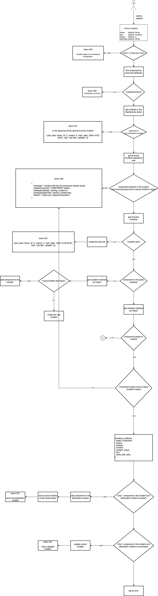

# Incident management V1 (short description)

## Prerequisites

In this document described the business logic schema for incident management. All actions require authorisation.

### User experience
Web page `/incidents`

On the page, user should fill `Incident Title`, `impact`, affected services and start date. All data in the form are required. 
After that, in the system will be created a record about this incident. 

### API experience
API endpoint is `/v1/component_status`

Metric processor can create an incident via API. But the logic a bit different from user experience.
```python
class ComponentStatusArgsSchema(Schema):
    impact = fields.Integer(required=True)
    name = fields.String(required=True)
    text = fields.String(required=False, dump_default="Incident")
    attributes = fields.List(fields.Nested(ComponentAttributeSchema))

```
Only `impact` and `name` are required.

Documentation from source code (can be outdated):

<details><summary>Documentation</summary>

Update component status

Process component status update and open new incident if required:

- current active maintenance for the component - do nothing
- current active incident for the component - do nothing
- current active incident NOT for the component - add component into
  the list of affected components
- no active incidents - create new one
- current active incident for the component and requested
  impact > current impact - run handling:

  If a component exists in an incident, but the requested
  impact is higher than the current one, then the component
  will be moved to another incident if it exists with the
  requested impact, otherwise a new incident will be created
  and the component will be moved to the new incident.
  If there is only one component in an incident, and an
  incident with the requested impact does not exist,
  then the impact of the incident will be changed to a higher
  one, otherwise the component will be moved to an existing
  incident with the requested impact, and the current incident
  will be closed by the system.
  The movement of a component and the closure of an incident
  will be reflected in the incident statuses.

This method requires authorization to be used.
</details>

Based on the source code the schema for API will be:


